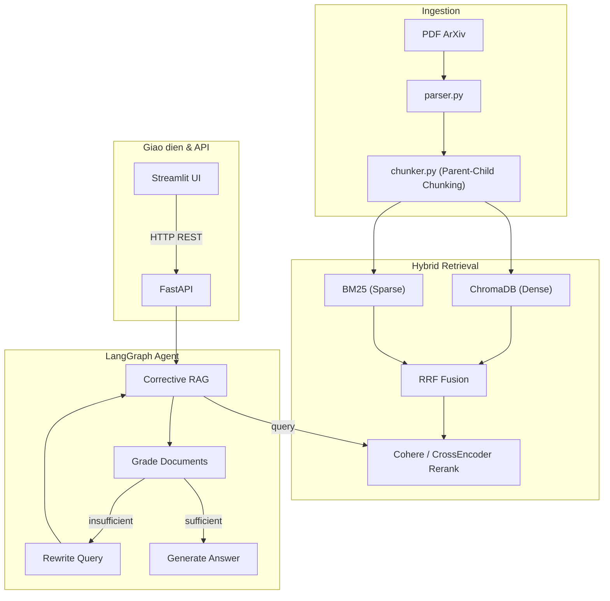

# ArXiv Agentic RAG

Corrective-RAG (CRAG) question-answering system over scientific PDF papers. Upload a paper, ask questions about it in Vietnamese or English, get answers grounded in the paper's content with source citations.



## Status

Mid-upgrade from MVP to a production-grade portfolio project. See [`docs/ROADMAP.md`](docs/ROADMAP.md) for the phased plan (current architecture decisions, known bugs already fixed, and what's planned next: Postgres+pgvector migration, eval harness, multi-paper querying, RAPTOR).

## Stack

- **Parsing**: PyMuPDF4LLM (with raw `fitz` fallback)
- **Chunking**: section-based parent-child (regex heading detection + sliding window)
- **Retrieval**: ChromaDB (dense) + BM25 (sparse) → Reciprocal Rank Fusion → Cohere Rerank / local CrossEncoder fallback
- **Agent**: LangGraph Corrective-RAG (`retrieve → grade → rewrite-if-insufficient → generate`)
- **LLM**: Groq (primary) with automatic runtime fallback to Gemini
- **Backend**: FastAPI
- **Frontend**: Streamlit
- **Deploy**: Railway (API) + Streamlit Cloud (UI)

## Setup

```bash
pip install -r requirements.txt
cp .env.example .env   # fill in GROQ_API_KEY, GEMINI_API_KEY, COHERE_API_KEY, HF_TOKEN
```

## Running

```bash
# API (from repo root, auto-reloads)
uvicorn app.api.main:app --reload --port 8000
# Swagger UI: http://localhost:8000/docs

# UI (separate process, calls the API over HTTP)
streamlit run streamlit_app.py
```

Or with the Makefile: `make run`, `make ui`.

## Docker

```bash
docker build -t arxiv-rag .
docker run -p 8000:8000 --env-file .env arxiv-rag
```

## Testing & linting

```bash
make test   # pytest tests/
make lint   # ruff check .
```

CI (`.github/workflows/ci.yml`) runs both on every push/PR to `main`.

## Project layout

- `app/ingestion/` — PDF parsing (`parser.py`) and parent-child chunking (`chunker.py`)
- `app/indexing/` — vector store (`vector_store.py`), BM25 (`bm25_store.py`), fusion + reranking (`hybrid_retriever.py`, `reranker.py`)
- `app/agent/` — LangGraph Corrective-RAG agent (`rag_graph.py`)
- `app/llm/` — LLM provider factory (`llm_factory.py`) and prompt templates (`prompt_templates.py`)
- `app/api/` — FastAPI app and routes
- `streamlit_app.py` — frontend
- `docs/ROADMAP.md` — upgrade plan and architecture decisions

See [`CLAUDE.md`](CLAUDE.md) for a deeper architecture walkthrough (data flow, known gaps, conventions) aimed at contributors working on the codebase.
