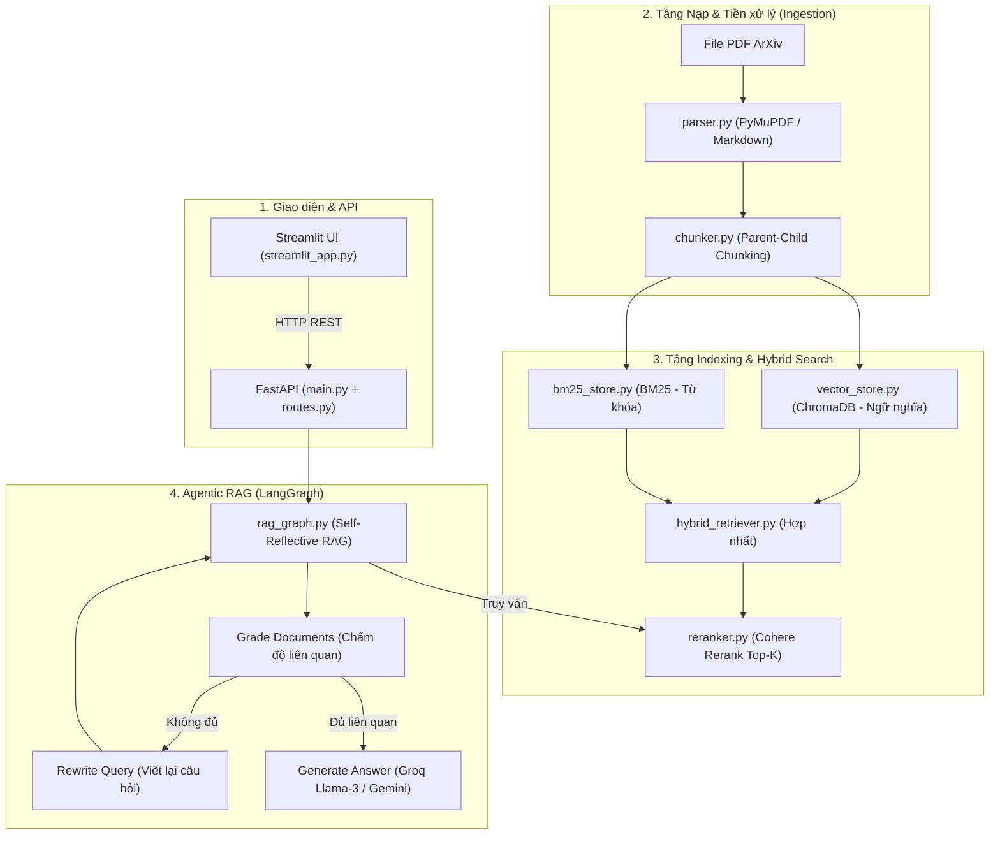

---

## 📌 Các Điểm Cần Cải Tiến Cho `app/ingestion/parser.py`

| STT | Tính năng cải tiến | Mô tả kỹ thuật | Mục tiêu & Lợi ích |
|:---:|---|---|---|
| **1** | **Giữ Metadata số trang (`page_chunks=True`)** | Gọi `pymupdf4llm.to_markdown(..., page_chunks=True)` trả về cấu trúc từng trang kèm số trang tương ứng. | Giúp hệ thống trích dẫn chính xác số trang (Page citation) cho câu trả lời của Agent. |
| **2** | **Tải tự động qua ArXiv ID / URL** | Tích hợp thư viện Python `arxiv` để tải trực tiếp file PDF từ mã ID (VD: `2303.08774`) và thu thập sẵn metadata (Title, Authors, Abstract). | Tiết kiệm thao tác tải thủ công về máy cho người dùng. |
| **3** | **Cơ chế Cache Markdown (`cache/parsed_markdown/`)** | Tính mã băm (MD5 / SHA256) của file PDF và lưu kết quả Markdown vào thư mục cache cục bộ. | Tránh parse lại tốn CPU khi khởi động lại ứng dụng, phản hồi tức thì (0.01s). |
| **4** | **Xử lý hình ảnh & đồ thị (Multimodal RAG)** | Bật `write_images=True` để xuất ảnh đồ thị / bảng biểu, sau đó gọi Vision LLM (Gemini Flash / GPT-4o-mini) tạo caption mô tả đưa vào text. | Cho phép AI trả lời được các câu hỏi liên quan đến biểu đồ và số liệu đồ họa. |
| **5** | **Bộ lọc dọn rác văn bản (Regex Cleaner)** | Thêm bước Regex hậu xử lý để loại bỏ header lặp lại ở đầu trang (`arXiv:xxxx.xxxxv1`), watermark và số trang. | Giảm độ nhiễu cho mô hình Vector Embedding, nâng cao chất lượng tìm kiếm. |
| **6** | **OCR Fallback cho tài liệu Scan / Ảnh** | Bổ sung lớp Fallback thứ 3 với `pytesseract` hoặc `easyocr` khi văn bản trích xuất bị rỗng. | Ngăn ngừa lỗi `RuntimeError` khi người dùng tải lên tài liệu PDF dạng scan ảnh. |

---

## 📌 Các Điểm Cần Cải Tiến Cho `app/ingestion/chunker.py`

| STT | Tính năng cải tiến | Mô tả kỹ thuật | Mục tiêu & Lợi ích |
|:---:|---|---|---|
| **1** | **Xử lý Bảng biểu thông minh (Table-Aware Chunking)** | Biến bảng thành khối đơn vị nguyên tử (Atomic block) không cắt vụn; nếu bảng quá dài (> max_chars) thì tự động sao chép lại dòng Header (`\| Col 1 \| Col 2 \|` và `\|---\|---|`) gắn vào đầu mỗi chunk con. | Giữ nguyên vẹn cấu trúc bảng số liệu, tránh việc chunk sau bị mất tiêu đề cột trở thành dữ liệu rác. |
| **2** | **Loại trừ câu in đậm & Mở rộng Regex Tiêu đề** | Thêm điều kiện loại trừ: đoạn in đậm kết thúc bằng dấu chấm `.` hoặc dài quá 12 từ thì là câu văn thường (không phải Section); mở rộng regex hỗ trợ đánh số thập phân (`1.1`, `2.3.1`), Title Case và phụ lục (`Appendix A`). | Ngăn chặn việc băm nát bài báo thành hàng chục section rác; không bỏ sót các section phụ lục toán học quan trọng. |
| **3** | **Chuyển cửa sổ lùi sang Tỷ lệ động (Dynamic Search Window)** | Thay thế các con số hardcode `-200`, `-150`, `-50` bằng tỷ lệ phần trăm theo `target` (`para_win = int(target * 0.25)`, `sent_win = int(target * 0.18)`, `word_win = min(50, int(target * 0.08))`). | Linh hoạt thích ứng khi người dùng thay đổi cấu hình `chunk_size` (200, 500 hay 2000) mà không bị lỗi âm chỉ số. |
| **4** | **Tính độ dài theo Token (Token-based Chunking)** | Sử dụng `tiktoken` hoặc HuggingFace tokenizer để đo kích thước chunk theo Tokens (vd: `max_tokens = 256`) thay vì đếm ký tự thô. | Đồng bộ hoàn hảo với Context Window của các mô hình Embedding và LLM, tránh tràn token. |
| **5** | **Làm giàu Siêu dữ liệu (Rich Metadata Enrichment)** | Bổ sung vào `ChildChunk` các trường: `page_number` (số trang), `chunk_index_in_section` (thứ tự trong section), và `has_formula` (cờ nhận diện công thức LaTeX `$ ... $`). | Giúp Agent định vị chính xác vị trí bài báo khi dẫn nguồn và ưu tiên đoạn giải thích công thức khi người dùng hỏi. |
| **6** | **Cắt theo ngữ nghĩa (Semantic Chunking)** | Tách câu và tính khoảng cách ngữ nghĩa (Cosine Distance) giữa các câu liên tiếp; ngắt chunk khi khoảng cách vượt ngưỡng (chuyển đổi chủ đề ý tứ). | Giữ trọn vẹn mạch tư duy của tác giả, không làm đứt đôi mối quan hệ nhân quả giữa các câu liền kề. |
