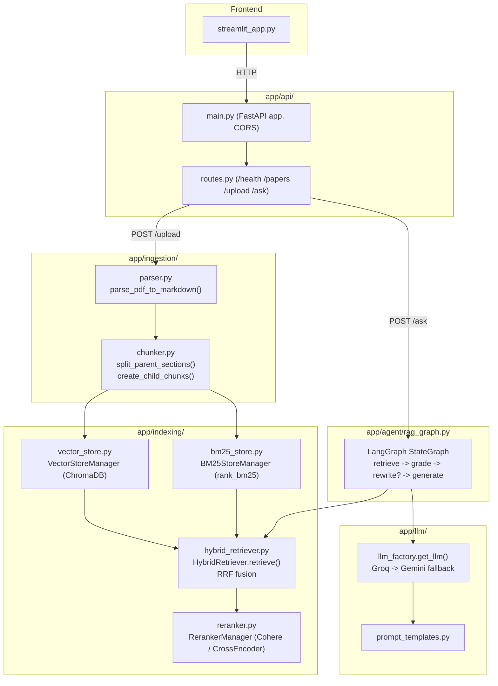

# Architecture

System reference for ArXiv Agentic RAG. For the upgrade plan and rationale behind pending architectural changes, see [`ROADMAP.md`](ROADMAP.md). For contributor conventions and gotchas, see [`../CLAUDE.md`](../CLAUDE.md).

## Overview



## Data flow

### Upload path (`POST /api/v1/upload`)

1. `routes.upload_paper()` saves the raw PDF to `data/`, slugifies the filename into a `paper_id` (unless one is supplied).
2. `chunker.process_paper_ingestion()` orchestrates:
   - `parser.parse_pdf_to_markdown()` — PyMuPDF4LLM (`page_chunks=True`) with a raw-`fitz` fallback if it OOMs. Output is a single Markdown string with `<!-- page:N -->` markers between pages.
   - `chunker.split_parent_sections()` — regex heading detection splits the Markdown into `ParentSection` objects (`section_id`, `section_name`, `text`).
   - `chunker.create_child_chunks()` — sliding-window split of each section into `ChildChunk` objects (`chunk_id`, `parent_section_id`, `parent_section_name`, `paper_id`, `text`, `is_table`), snapping cuts to paragraph → sentence → word boundaries.
3. Chunks are cached to `data/chunks_cache/{paper_id}_chunks.json` so re-uploading the same `paper_id` skips re-parsing.
4. `VectorStoreManager.add_child_chunks()` embeds each chunk via the HF Inference API and writes it into the single global ChromaDB collection `arxiv_papers` (isolated by a `paper_id` metadata filter, not separate collections).
5. `BM25StoreManager.build_index()` tokenizes each chunk and merges it into the on-disk BM25 corpus (`data/bm25_index/*.pkl`), keyed by `chunk_id` — this does **not** replace other papers already indexed.
6. `paper_id → {title, filename, num_chunks}` is appended to `data/papers_registry.json`.

**Note:** `ParentSection`s are produced in step 2 but never persisted past that function call — only `ChildChunk`s reach the index. There is currently no way to expand a matched chunk back out to its full section.

### Query path (`POST /api/v1/ask`)

1. `routes.ask_agent()` validates `paper_id` against the registry, then calls `rag_graph.ask(question, paper_id, thread_id)` — the only public entry point into the agent.
2. `rag_graph.py` runs a LangGraph `StateGraph` over `AgentState`:

   ```
   retrieve -> grade -> [insufficient?] -> rewrite -> retrieve -> grade -> ...
                      -> [sufficient, or MAX_REWRITES=2 hit] -> generate -> END
   ```

   - `retrieve_node`: `HybridRetriever.retrieve()` — dense (ChromaDB, top-20) and sparse (BM25, top-20) search run independently, fused via unweighted `reciprocal_rank_fusion()` (`k=60`), then reranked (Cohere Rerank if `COHERE_API_KEY` set, else a local CrossEncoder) down to top-5.
   - `grade_node`: one LLM call judges the whole batch of retrieved chunks sufficient/insufficient (not per-document).
   - `rewrite_node`: LLM rewrites the question in isolation (no access to the retrieved context or why grading failed) and loops back to `retrieve`.
   - `generate_node`: builds a prompt from the retrieved chunks + last 6 messages of conversation history, calls the LLM, and appends the turn to `messages`.
3. Conversation memory is a `SqliteSaver` at `data/chat_memory.db`, keyed by `thread_id`.
4. `routes.ask_agent()` reads `result["retrieved_chunks"]` to populate the `sources` field of the response (each item already carries `chunk_id`, `parent_section_name`, `text`).

## Layers

| Layer | Files | Responsibility |
|---|---|---|
| Ingestion | `app/ingestion/parser.py`, `chunker.py` | PDF → Markdown → `ParentSection`/`ChildChunk` |
| Indexing / Retrieval | `app/indexing/vector_store.py`, `bm25_store.py`, `hybrid_retriever.py`, `reranker.py` | Dense + sparse index, fusion, reranking |
| Agent | `app/agent/rag_graph.py` | LangGraph Corrective-RAG state machine |
| LLM | `app/llm/llm_factory.py`, `prompt_templates.py` | Provider-agnostic LLM construction + prompts |
| API | `app/api/main.py`, `routes.py`, `schemas.py` | FastAPI app, HTTP contracts |
| Frontend | `streamlit_app.py` | Chat UI, calls the API over HTTP |
| Config | `app/config.py` | `pydantic-settings` loaded from `.env`; also redirects `HF_HOME`/`OLLAMA_MODELS` into `cache/` on import |

## Key data structures

```python
# app/ingestion/chunker.py
@dataclass
class ParentSection:
    section_id: str
    section_name: str
    text: str

@dataclass
class ChildChunk:
    chunk_id: str
    parent_section_id: str
    parent_section_name: str
    paper_id: str
    text: str
    is_table: bool = False

# app/agent/rag_graph.py
class AgentState(TypedDict):
    question: str
    paper_id: str
    retrieved_chunks: list       # list[dict], not LangChain Document
    grade: str                   # "yes" | "no"
    rewrite_count: int
    answer: str
    messages: Annotated[list, add_messages]
```

## State & persistence (current)

| What | Where | Survives redeploy? |
|---|---|---|
| Uploaded PDFs | `data/*.pdf` | No (ephemeral disk on Railway) |
| Parsed chunks cache | `data/chunks_cache/*.json` | No |
| Dense vectors | `data/chroma_db/` (ChromaDB) | No |
| Sparse index | `data/bm25_index/*.pkl` | No |
| Paper registry | `data/papers_registry.json` | No |
| Chat history | `data/chat_memory.db` (SQLite) | No |
| Model download cache | `cache/huggingface/` | No |

None of the above survives a Railway redeploy — this is the top item in `ROADMAP.md` Phase 2 (migrating everything to Supabase Postgres + pgvector).

## Deployment topology

- **API**: Railway, single Docker container (`Dockerfile`), FastAPI on `$PORT` (defaults to 8000 locally).
- **UI**: Streamlit Community Cloud, separate deploy, talks to the API over HTTP (`API_BASE` resolved via env var → `st.secrets` → local fallback in `streamlit_app.py`).
- **External APIs**: Groq (primary LLM), Gemini (fallback LLM + future embedding model), Cohere (rerank), HuggingFace Inference API (current embedding model).

## Known gaps

See `ROADMAP.md` sections 1–2 for the full list of architecture decisions and verified bugs already fixed. Highlights relevant to anyone reading this file for the first time:

- "Parent-child chunking" only chunks — parent section expansion isn't implemented.
- Single global ChromaDB collection; per-paper isolation is a metadata filter, not a partition.
- `/upload` blocks the FastAPI event loop for the full parse+embed duration (sync work inside `async def`).
- No persistence layer survives a redeploy (see table above).
