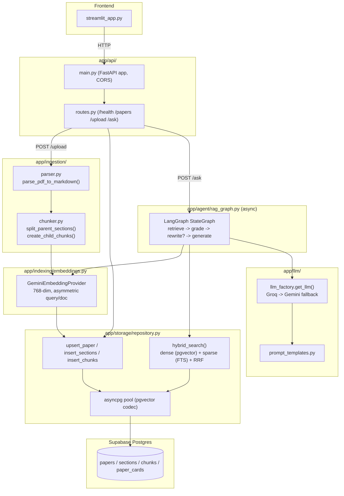

# Architecture

System reference for ArXiv Agentic RAG. For the upgrade plan and rationale behind pending architectural changes, see [`ROADMAP.md`](ROADMAP.md). For contributor conventions and gotchas, see [`../CLAUDE.md`](../CLAUDE.md). For current in-progress state, see [`../project-memory/STATE.md`](../project-memory/STATE.md).

> **Phase 2 cutover done (2026-09-20):** storage moved from ChromaDB + BM25 pickles + a JSON registry to a single Supabase Postgres (pgvector + full-text search). This doc describes the **current** (post-cutover) architecture. `app/indexing/vector_store.py`, `bm25_store.py`, and `hybrid_retriever.py` still exist on disk but are dead code — nothing imports them anymore — kept temporarily as a rollback path (see `project-memory/NEXT_STEPS.md`).

## Overview


```mermaid
flowchart TD
    subgraph UI["Frontend"]
        ST["streamlit_app.py"]
    end

    subgraph API["app/api/"]
        MAIN["main.py (FastAPI app, CORS)"]
        ROUTES["routes.py (/health /papers /upload /ask)"]
    end

    subgraph ING["app/ingestion/"]
        PARSER["parser.py\nparse_pdf_to_markdown()"]
        CHUNKER["chunker.py\nsplit_parent_sections()\ncreate_child_chunks()"]
    end

    subgraph EMB["app/indexing/embeddings.py"]
        GEMINI["GeminiEmbeddingProvider\n768-dim, asymmetric query/doc"]
    end

    subgraph STORE["app/storage/repository.py"]
        POOL["asyncpg pool (pgvector codec)"]
        CRUD["upsert_paper / insert_sections / insert_chunks"]
        SEARCH["hybrid_search()\ndense (pgvector) + sparse (FTS) + RRF"]
    end

    subgraph PG["Supabase Postgres"]
        TABLES[("papers / sections / chunks / paper_cards")]
    end

    subgraph AGENT["app/agent/rag_graph.py (async)"]
        GRAPH["LangGraph StateGraph\nretrieve -> grade -> rewrite? -> generate"]
    end

    subgraph LLM["app/llm/"]
        FACTORY["llm_factory.get_llm()\nGroq -> Gemini fallback"]
        PROMPTS["prompt_templates.py"]
    end

    ST -->|HTTP| MAIN --> ROUTES
    ROUTES -->|POST /upload| PARSER --> CHUNKER
    CHUNKER --> GEMINI --> CRUD
    ROUTES --> CRUD
    CRUD --> POOL --> TABLES
    ROUTES -->|POST /ask| GRAPH
    GRAPH --> GEMINI
    GRAPH --> SEARCH
    SEARCH --> POOL
    GRAPH --> FACTORY --> PROMPTS
```

## Data flow

### Upload path (`POST /api/v1/upload`)

1. `routes.upload_paper()` saves the raw PDF to `data/`, slugifies the filename into a `paper_id` (unless one is supplied).
2. `chunker.process_paper_ingestion()` orchestrates:
   - `parser.parse_pdf_to_markdown()` — PyMuPDF4LLM (`page_chunks=True`) with a raw-`fitz` fallback if it OOMs. Output is a single Markdown string with `<!-- page:N -->` markers between pages (not yet consumed downstream — page-aware chunking is still on the backlog).
   - `chunker.split_parent_sections()` — regex heading detection splits the Markdown into `ParentSection` objects (`section_id`, `section_name`, `text`).
   - `chunker.create_child_chunks()` — sliding-window split of each section into `ChildChunk` objects (`chunk_id`, `parent_section_id`, `parent_section_name`, `paper_id`, `text`, `is_table`), snapping cuts to paragraph → sentence → word boundaries.
   - The Phase 1 JSON chunk cache (`load_chunks_from_file`) is **no longer used** here — it only ever cached `ChildChunk`s, never `ParentSection`s, so a cache hit would silently produce empty sections now that sections are actually persisted. Every upload re-parses.
3. `embeddings.get_embedding_provider().embed_documents()` embeds every chunk's text via the Gemini API (`task_type=RETRIEVAL_DOCUMENT`, 768-dim). Batches of ≤100 texts with a **61-second sleep between batches** — Gemini's free-tier quota is metered per embedded item per minute, not per HTTP call, so a 182-chunk paper takes noticeably longer than a 90-chunk one to upload (see `project-memory/FIXED_BUGS.md` #11).
4. `repository.upsert_paper()` writes the `papers` row (`status="processing"` first, then `"ready"` once steps 5-6 succeed), `repository.insert_sections()` writes `ParentSection`s and returns a `{section_id: postgres_pk}` map, `repository.insert_chunks()` writes `ChildChunk`s + their embeddings using that map for the `section_pk` foreign key.
5. Postgres auto-generates the `fts` (full-text search) column on `chunks` via `GENERATED ALWAYS AS (to_tsvector(...))` — no separate sparse-index write step, which is what eliminates the Phase 1 class of bug where the dense and sparse indexes could drift out of sync (`FIXED_BUGS.md` #6).

**Note:** this whole flow is still synchronous from the client's point of view — `/upload` blocks until parsing + embedding + writing finish, which for a large paper now includes the rate-limit cooldown from step 3. `BackgroundTasks` is the next planned change (`project-memory/NEXT_STEPS.md`).

### Query path (`POST /api/v1/ask`)

1. `routes.ask_agent()` checks the paper exists via `repository.get_paper()`, then calls `rag_graph.ask(question, paper_id, thread_id)` — the only public entry point into the agent. Both this route and the whole graph are `async`.
2. `rag_graph.py` runs a LangGraph `StateGraph` over `AgentState`:

   ```
   retrieve -> grade -> [insufficient?] -> rewrite -> retrieve -> grade -> ...
                      -> [sufficient, or MAX_REWRITES=2 hit] -> generate -> END
   ```

   - `retrieve_node` (async): embeds the question (`embed_query`, `task_type=RETRIEVAL_QUERY`), calls `repository.hybrid_search()` — dense (pgvector cosine `<=>`, backed by an HNSW index) and sparse (Postgres `websearch_to_tsquery` + `ts_rank_cd`) run concurrently via `asyncio.gather`, fused by the same `reciprocal_rank_fusion()` function from Phase 1 (reused as-is — the algorithm doesn't care what produced the two ranked lists), then reranked (Cohere if `COHERE_API_KEY` is set, else a local CrossEncoder) down to top-5.
   - `grade_node`, `rewrite_node`, `generate_node`: same logic as Phase 1, just `async def` now with `await chain.ainvoke(...)` instead of `chain.invoke(...)` — LangChain runnables support both natively, so the prompts/templates didn't need to change.
3. Conversation memory is `AsyncSqliteSaver` at `data/chat_memory.db` (still SQLite — only the sync/async wrapper changed; the Postgres checkpointer migration is a separate, not-yet-done step). The graph itself is built lazily on first call (`_get_rag_app()`), matching the same lazy-async-singleton pattern `repository.get_pool()` uses, because compiling the graph needs an awaited connection that can't happen at plain module-import time.
4. `routes.ask_agent()` reads `result["retrieved_chunks"]` to populate the `sources` field of the response (each item carries `chunk_id`, `parent_section_name`, `text`).

**Why async was mandatory, not a style choice:** `asyncpg` (the Postgres driver) only supports async. Bridging a single sync node with `asyncio.run()` would have broken `repository.py`'s cached connection pool across calls — a pool is bound to the event loop that created it, and `asyncio.run()` creates and tears down a new loop every call.

## Layers

| Layer | Files | Responsibility |
|---|---|---|
| Ingestion | `app/ingestion/parser.py`, `chunker.py` | PDF → Markdown → `ParentSection`/`ChildChunk` |
| Embedding | `app/indexing/embeddings.py` | `GeminiEmbeddingProvider` (768-dim, asymmetric query/document, self-throttled) |
| Storage | `app/storage/repository.py` | Postgres connection pool, CRUD for papers/sections/chunks, `hybrid_search()` |
| Reranking | `app/indexing/reranker.py` | `RerankerManager` (Cohere / local CrossEncoder) — unchanged from Phase 1, data-source agnostic |
| Agent | `app/agent/rag_graph.py` | LangGraph Corrective-RAG state machine (async) |
| LLM | `app/llm/llm_factory.py`, `prompt_templates.py` | Provider-agnostic LLM construction + prompts |
| API | `app/api/main.py`, `routes.py`, `schemas.py` | FastAPI app, HTTP contracts |
| Frontend | `streamlit_app.py` | Chat UI, calls the API over HTTP |
| Config | `app/config.py` | `pydantic-settings` loaded from `.env`; also redirects `HF_HOME`/`OLLAMA_MODELS` into `cache/` on import |
| *(dead code)* | `app/indexing/vector_store.py`, `bm25_store.py`, `hybrid_retriever.py` | Phase 1 ChromaDB/BM25 pipeline — not imported anywhere anymore, kept temporarily for rollback |

## Key data structures

```python
# app/ingestion/chunker.py — unchanged from Phase 1; page_num/char_start/
# char_end/level are still backlog items, so the Postgres columns for them
# are always NULL today (see db/schema.sql and project-memory/NEXT_STEPS.md)
@dataclass
class ParentSection:
    section_id: str
    section_name: str
    text: str

@dataclass
class ChildChunk:
    chunk_id: str
    parent_section_id: str
    parent_section_name: str
    paper_id: str
    text: str
    is_table: bool = False

# app/agent/rag_graph.py
class AgentState(TypedDict):
    question: str
    paper_id: str
    retrieved_chunks: list       # list[dict], not LangChain Document
    grade: str                   # "yes" | "no"
    rewrite_count: int
    answer: str
    messages: Annotated[list, add_messages]
```

```sql
-- db/schema.sql (Supabase). See the file itself for the full DDL with
-- indexes; this is the shape, not the exact statements.
papers(paper_id PK, title, authors, arxiv_id, filename, file_hash UNIQUE,
       num_pages, num_chunks, status, created_at)
sections(id PK, paper_id FK, section_id, name, level, text, page_start, page_end)
chunks(id PK, chunk_id UNIQUE, paper_id FK, section_pk FK, text,
       page_num, char_start, char_end, is_table, level,
       embedding vector(768),               -- HNSW index, cosine ops
       fts tsvector GENERATED ALWAYS AS (to_tsvector('english', text)) STORED)  -- GIN index
paper_cards(paper_id PK/FK, summary, embedding vector(768))  -- Phase 4, not used yet
```

## State & persistence (current)

| What | Where | Survives redeploy? |
|---|---|---|
| Uploaded PDFs | `data/*.pdf` | No (ephemeral disk on Railway) |
| Papers, sections, chunks, embeddings | **Supabase Postgres** | **Yes** |
| Chat history | `data/chat_memory.db` (SQLite via `AsyncSqliteSaver`) | No — Postgres checkpointer migration still pending |
| Model download cache | `cache/huggingface/` | No (only used by the now-dead `sentence-transformers` CrossEncoder fallback path in `reranker.py`) |

The core data (papers/sections/chunks/embeddings) now survives a redeploy — this was the top item in `ROADMAP.md` Phase 2 and is done. Chat history is the one piece still on ephemeral disk.

## Deployment topology

- **API**: Railway, single Docker container (`Dockerfile`), FastAPI on `$PORT` (defaults to 8000 locally). **Not yet redeployed to Railway with the Phase 2 code** — verified so far via local `uvicorn` + a real Supabase project, not the production environment.
- **UI**: Streamlit Community Cloud, separate deploy, talks to the API over HTTP (`API_BASE` resolved via env var → `st.secrets` → local fallback in `streamlit_app.py`).
- **Database**: Supabase Postgres, connected via the **Session pooler** (`aws-0-<region>.pooler.supabase.com`) — not the "Direct connection" host, which is IPv6-only and unreachable from networks without IPv6 egress (`project-memory/FIXED_BUGS.md` #8).
- **External APIs**: Groq (primary LLM), Gemini (fallback LLM + embeddings), Cohere (rerank, optional).

## Known gaps

See `ROADMAP.md` Phase 2 checklist and `project-memory/NEXT_STEPS.md` for the full, currently-accurate list. Highlights relevant to anyone reading this file for the first time:

- `/upload` still blocks synchronously — now includes the embedding rate-limit cooldown for large papers, making `BackgroundTasks` a higher priority than originally planned.
- Chat history (SQLite) doesn't survive a redeploy; the rest of the data does.
- No page numbers / char offsets on chunks yet — `chunker.py` hasn't been upgraded to page-aware chunking.
- No `DELETE /papers/{id}` route yet, though `repository.delete_paper()` exists.
- Not yet redeployed to Railway — only verified locally against the real Supabase project.
