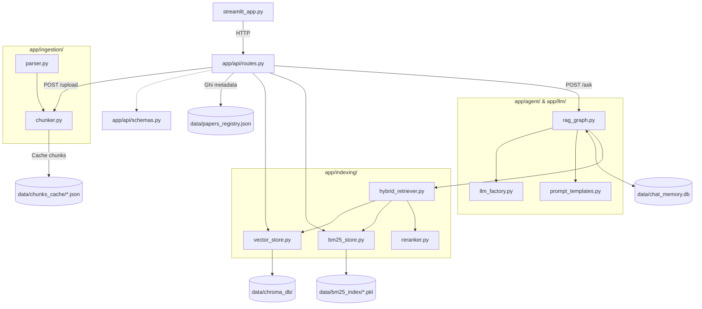
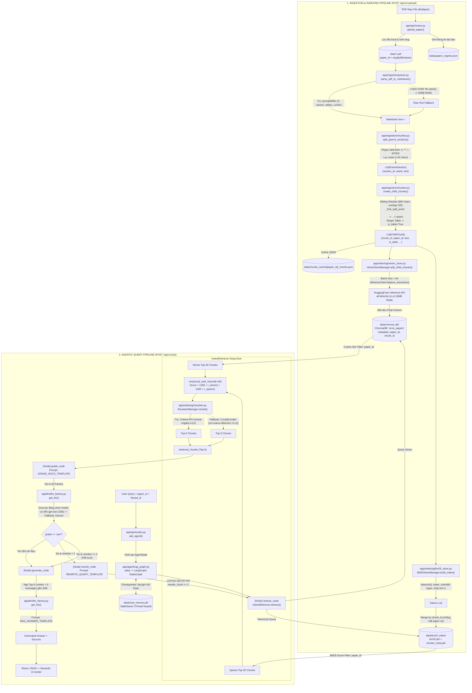
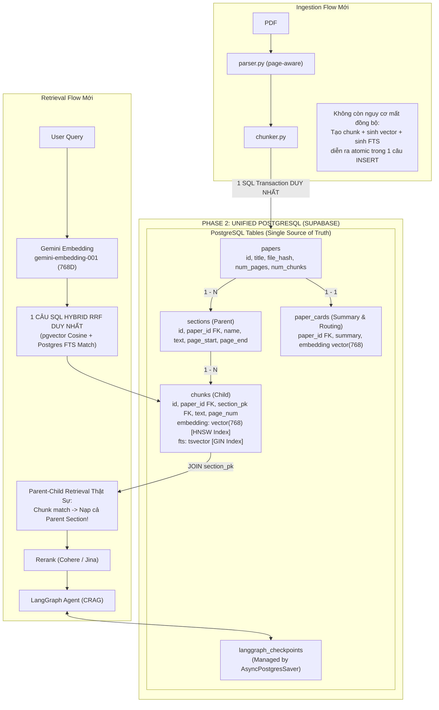

## Sơ đồ tổng quan quan hệ giữa các File (File-level Architecture)

---

## Sơ đồ 1: Luồng dữ liệu chi tiết (Phase 1 hiện tại)

---

## Sơ đồ 2: Luồng dữ liệu tiến hóa (Target Phase 2 - Supabase Unified)

