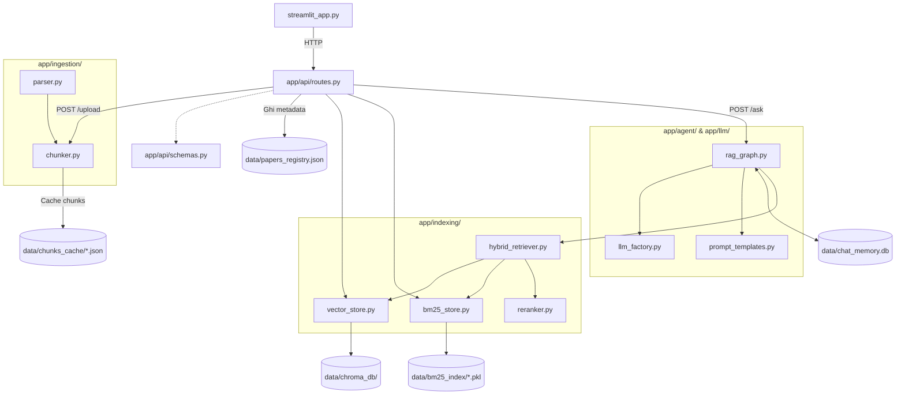
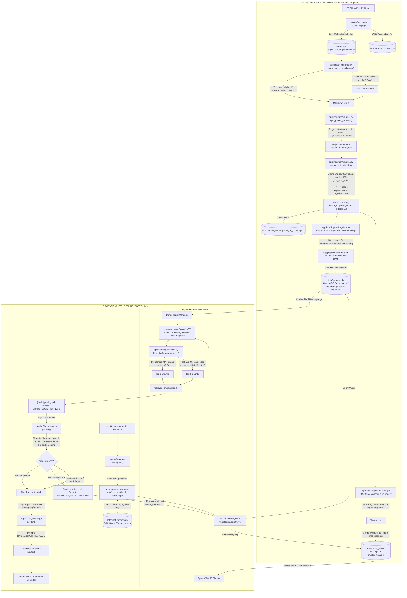
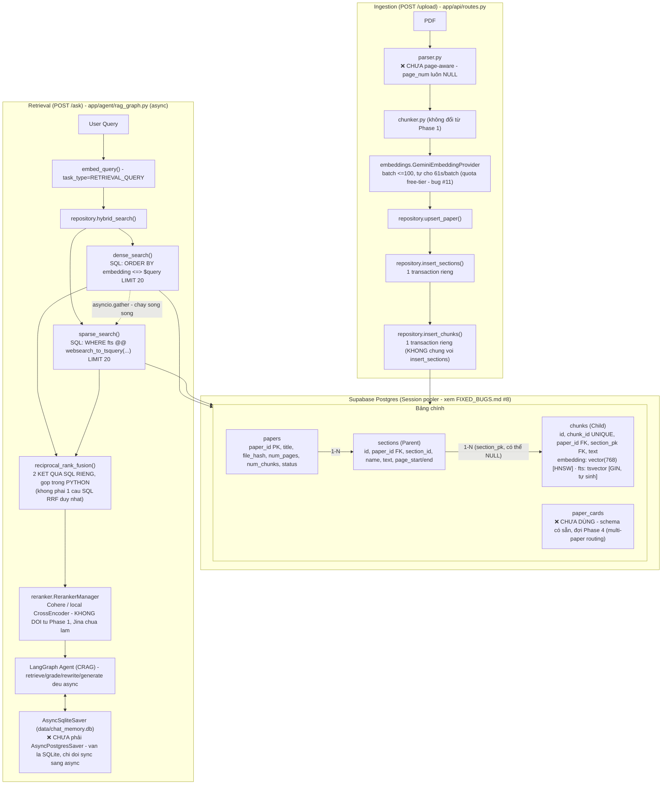

## 📜 Sơ đồ tổng quan quan hệ giữa các File — LỊCH SỬ (Phase 1, đã thay bằng Phase 2 ở Sơ đồ 2 bên dưới)

> Giữ lại để tham khảo cấu trúc cũ. Kiến trúc hiện tại xem `Architecture.md` (mục Overview) hoặc Sơ đồ 2 ở cuối file này. `vector_store.py`/`bm25_store.py`/`hybrid_retriever.py` nhắc tới bên dưới giờ là dead code.

```mermaid
flowchart TD
    %% UI & API
    UI["streamlit_app.py"] -->|"HTTP"| ROUTES["app/api/routes.py"]
    ROUTES -.-> SCHEMAS["app/api/schemas.py"]

    %% Ingestion Pipeline
    subgraph INGESTION ["app/ingestion/"]
        PARSER["parser.py"] --> CHUNKER["chunker.py"]
    end
    ROUTES -->|"POST /upload"| CHUNKER
    CHUNKER -->|"Cache chunks"| CACHE_JSON[("data/chunks_cache/*.json")]
    ROUTES -->|"Ghi metadata"| REG_JSON[("data/papers_registry.json")]

    %% Indexing & Retrieval
    subgraph INDEXING ["app/indexing/"]
        V_STORE["vector_store.py"]
        B_STORE["bm25_store.py"]
        HYBRID["hybrid_retriever.py"]
        RERANK["reranker.py"]
        
        HYBRID --> V_STORE
        HYBRID --> B_STORE
        HYBRID --> RERANK
    end
    ROUTES --> V_STORE --> CHROMA_DB[("data/chroma_db/")]
    ROUTES --> B_STORE --> BM25_PKL[("data/bm25_index/*.pkl")]

    %% Agent & LLM
    subgraph AGENT_LLM ["app/agent/ & app/llm/"]
        GRAPH["rag_graph.py"]
        LLM["llm_factory.py"]
        PROMPTS["prompt_templates.py"]
        
        GRAPH --> LLM
        GRAPH --> PROMPTS
    end
    ROUTES -->|"POST /ask"| GRAPH
    GRAPH <--> CHAT_DB[("data/chat_memory.db")]
    GRAPH --> HYBRID
```

---

## 📜 Sơ đồ 1: Luồng dữ liệu chi tiết Phase 1 — LỊCH SỬ (đã thay bằng Sơ đồ 2)

```mermaid
flowchart TD
    subgraph INGESTION_PIPELINE ["1. INGESTION & INDEXING PIPELINE (POST /api/v1/upload)"]
        direction TB
        F_IN["PDF Raw File (Multipart)"] --> ROUTE_UP["app/api/routes.py<br/>upload_paper()"]
        ROUTE_UP -->|"Lưu đĩa local & sinh slug"| D_PDF[("data/*.pdf<br/>paper_id = slugify(filename)")]

        D_PDF --> PARSER["app/ingestion/parser.py<br/>parse_pdf_to_markdown()"]
        PARSER -->|"Try: pymupdf4llm (2-column, tables, LaTeX)"| MD_OK["Markdown text + <!-- page:N -->"]
        PARSER -.->|"Catch OOM: fitz.open() (~15MB RAM)"| MD_FALLBACK["Raw Text Fallback"]
        MD_FALLBACK --> MD_OK

        MD_OK --> CHUNKER_P["app/ingestion/chunker.py<br/>split_parent_sections()"]
        CHUNKER_P -->|"Regex detection: #, **, I. INTRO<br/>Lọc noise (<30 chars)"| P_SECTS["List[ParentSection]<br/>(section_id, name, text)"]

        P_SECTS --> CHUNKER_C["app/ingestion/chunker.py<br/>create_child_chunks()"]
        CHUNKER_C -->|"Sliding Window (800 chars, overlap 150)<br/>_find_split_point: \n\n -> . -> space<br/>Regex Table -> is_table=True"| C_CHUNKS["List[ChildChunk]<br/>(chunk_id, paper_id, text, is_table, ...)"]

        C_CHUNKS -->|"Cache JSON"| D_CACHE[("data/chunks_cache/{paper_id}_chunks.json")]

        %% Nhánh Dense
        C_CHUNKS --> V_MGR["app/indexing/vector_store.py<br/>VectorStoreManager.add_child_chunks()"]
        V_MGR -->|"Batch size = 64<br/>InferenceClient.feature_extraction()"| HF_API["HuggingFace Inference API<br/>all-MiniLM-L6-v2 (0MB RAM)"]
        HF_API -->|"384-dim Float Vectors"| V_CHROMA[("data/chroma_db/<br/>ChromaDB: 'arxiv_papers'<br/>metadata: paper_id, chunk_id")]

        %% Nhánh Sparse
        C_CHUNKS --> BM_MGR["app/indexing/bm25_store.py<br/>BM25StoreManager.build_index()"]
        BM_MGR -->|"tokenize(): lower, scientific regex, drop len=1"| BM_TOK["Tokens List"]
        BM_TOK -->|"Merge by chunk_id (chống mất paper cũ)"| BM_PKL[("data/bm25_index/<br/>bm25.pkl + chunks_meta.pkl")]

        %% Metadata Registry
        ROUTE_UP -->|"Ghi thông tin bài báo"| REG_JSON[("data/papers_registry.json")]
    end

    subgraph QUERY_PIPELINE ["2. AGENTIC QUERY PIPELINE (POST /api/v1/ask)"]
        direction TB
        USER_Q["User Query + paper_id + thread_id"] --> ROUTE_ASK["app/api/routes.py<br/>ask_agent()"]
        ROUTE_ASK -->|"Khởi tạo AgentState"| GRAPH["app/agent/rag_graph.py<br/>ask() -> LangGraph StateGraph"]

        GRAPH <-->|"Checkpointer: đọc/ghi hội thoại"| SQLITE_MEM[("data/chat_memory.db<br/>SqliteSaver (Thread Keyed)")]

        %% RETRIEVE NODE
        GRAPH --> N_RETRIEVE["[Node] retrieve_node<br/>HybridRetriever.retrieve()"]
        
        subgraph HYBRID_INTERNAL ["HybridRetriever Deep-Dive"]
            N_RETRIEVE -->|"Query Vector"| V_CHROMA
            N_RETRIEVE -->|"Tokenized Query"| BM_PKL
            V_CHROMA -->|"Cosine Sim Filter: paper_id"| DENSE_TOP20["Dense Top-20 Chunks"]
            BM_PKL -->|"BM25 Score Filter: paper_id"| SPARSE_TOP20["Sparse Top-20 Chunks"]

            DENSE_TOP20 & SPARSE_TOP20 --> RRF["reciprocal_rank_fusion(k=60)<br/>Score = 1/(60 + r_dense) + 1/(60 + r_sparse)"]
            RRF --> RERANK_MGR["app/indexing/reranker.py<br/>RerankerManager.rerank()"]

            RERANK_MGR -->|"Try: Cohere API (rerank-english-v3.0)"| COHERE_OUT["Top-5 Chunks"]
            RERANK_MGR -.->|"Fallback: CrossEncoder (ms-marco-MiniLM-L-6-v2)"| LOCAL_CE_OUT["Top-5 Chunks"]
            COHERE_OUT --> CANDIDATES_5["retrieved_chunks (Top-5)"]
            LOCAL_CE_OUT --> CANDIDATES_5
        end

        CANDIDATES_5 --> N_GRADE["[Node] grade_node<br/>Prompt: GRADE_DOCS_TEMPLATE"]
        N_GRADE -->|"Gọi LLM Factory"| FACTORY_G["app/llm/llm_factory.py<br/>get_llm()"]
        FACTORY_G -->|"Groq (tự động chọn model, ưu tiên gpt-oss-120b) -> Fallback: Gemini"| GRADE_RES{"grade == 'yes'?"}

        GRADE_RES -->|"Yes (Đủ dữ liệu)"| N_GEN["[Node] generate_node"]
        GRADE_RES -->|"No & rewrites < 2"| N_REWRITE["[Node] rewrite_node<br/>Prompt: REWRITE_QUERY_TEMPLATE"]
        GRADE_RES -->|"No & rewrites >= 2<br/>(Hết lượt)"| N_GEN

        N_REWRITE -->|"LLM tạo câu hỏi mới<br/>rewrite_count += 1"| N_RETRIEVE

        N_GEN -->|"Nạp Top-5 context + 6 messages gần nhất"| FACTORY_GEN["app/llm/llm_factory.py<br/>get_llm()"]
        FACTORY_GEN -->|"Prompt: RAG_ANSWER_TEMPLATE"| GEN_RES["Generated Answer + Sources"]
        GEN_RES --> RETURN_API["Return JSON -> Streamlit UI render"]
    end
```

---

## Sơ đồ 2: Luồng dữ liệu Phase 2 — HIỆN TẠI (cutover xong, verify thật 2026-09-20)

> Bản này đã sửa lại theo đúng code thật, khác vài chỗ so với bản phác thảo "Target" ban đầu (ghi chú "❌ chưa làm" ở dưới cho những chỗ khác dự kiến).

```mermaid
flowchart TD
    subgraph PG ["Supabase Postgres (Session pooler - xem FIXED_BUGS.md #8)"]
        direction TB

        subgraph TABLES ["Bảng chính"]
            T_PAPERS["papers<br/>paper_id PK, title, file_hash, num_pages, num_chunks, status"]
            T_SECTS["sections (Parent)<br/>id, paper_id FK, section_id, name, text, page_start/end"]
            T_CHUNKS["chunks (Child)<br/>id, chunk_id UNIQUE, paper_id FK, section_pk FK, text<br/>embedding: vector(768) [HNSW] · fts: tsvector [GIN, tự sinh]"]
            T_CARDS["paper_cards<br/>❌ CHƯA DÙNG - schema có sẵn, đợi Phase 4 (multi-paper routing)"]
        end

        T_PAPERS -->|"1-N"| T_SECTS
        T_SECTS -->|"1-N (section_pk, có thể NULL)"| T_CHUNKS
    end

    subgraph ING ["Ingestion (POST /upload) - app/api/routes.py"]
        PDF2["PDF"] --> PARSE2["parser.py<br/>❌ CHƯA page-aware - page_num luôn NULL"]
        PARSE2 --> CHUNK2["chunker.py (không đổi từ Phase 1)"]
        CHUNK2 --> EMB2["embeddings.GeminiEmbeddingProvider<br/>batch <=100, tự cho 61s/batch (quota free-tier - bug #11)"]
        EMB2 --> INS1["repository.upsert_paper()"]
        INS1 --> INS2["repository.insert_sections()<br/>1 transaction rieng"]
        INS2 --> INS3["repository.insert_chunks()<br/>1 transaction rieng (KHONG chung voi insert_sections)"]
        INS3 --> TABLES
    end

    subgraph RET ["Retrieval (POST /ask) - app/agent/rag_graph.py (async)"]
        Q2["User Query"] --> EMB_GEMINI["embed_query() - task_type=RETRIEVAL_QUERY"]

        EMB_GEMINI --> HSEARCH["repository.hybrid_search()"]
        HSEARCH --> DENSE["dense_search()<br/>SQL: ORDER BY embedding <=> $query LIMIT 20"]
        HSEARCH --> SPARSE["sparse_search()<br/>SQL: WHERE fts @@ websearch_to_tsquery(...) LIMIT 20"]
        DENSE -.->|"asyncio.gather - chay song song"| SPARSE
        DENSE --> RRF2["reciprocal_rank_fusion()<br/>2 KET QUA SQL RIENG, gop trong PYTHON<br/>(khong phai 1 cau SQL RRF duy nhat)"]
        SPARSE --> RRF2
        DENSE --> TABLES
        SPARSE --> TABLES

        RRF2 --> RERANK2["reranker.RerankerManager<br/>Cohere / local CrossEncoder - KHONG DOI tu Phase 1, Jina chua lam"]
        RERANK2 --> AGENT2["LangGraph Agent (CRAG) - retrieve/grade/rewrite/generate deu async"]
        AGENT2 <--> CHECKPOINT["AsyncSqliteSaver (data/chat_memory.db)<br/>❌ CHƯA phải AsyncPostgresSaver - van la SQLite, chi doi sync sang async"]
    end
```

**Khác với bản "Target" phác thảo ban đầu — 3 chỗ đã cố ý làm khác đi khi thật sự code:**
1. **Không có "1 SQL transaction duy nhất"** cho ingestion — `insert_sections()` và `insert_chunks()` là 2 transaction riêng (đơn giản hơn, vẫn đủ an toàn vì `section_pk` map được tạo xong trước khi insert chunks).
2. **Không có "1 câu SQL hybrid RRF duy nhất"** — dense và sparse là 2 câu SQL riêng chạy song song (`asyncio.gather`), RRF fusion làm ở tầng Python bằng hàm đã test sẵn từ Phase 1 (`reciprocal_rank_fusion()`), không viết lại thuật toán RRF bằng SQL.
3. **"Parent-Child Retrieval thật sự" (mở rộng chunk ra cả parent section) chưa làm** — `hybrid_search()` hiện chỉ trả `parent_section_name` (qua `LEFT JOIN`) để hiển thị, chưa nạp toàn bộ text của parent section vào context. Đây là backlog Phase 3 ("small-to-big" retrieval).

Checkpointer (`AsyncPostgresSaver`) và `paper_cards` (Phase 4) vẫn như dự kiến ban đầu — chưa làm, không phải khác đi.
